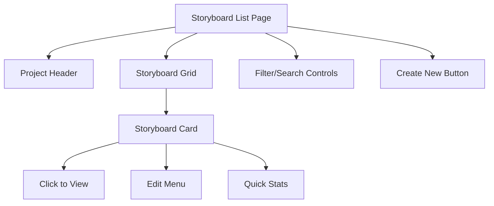
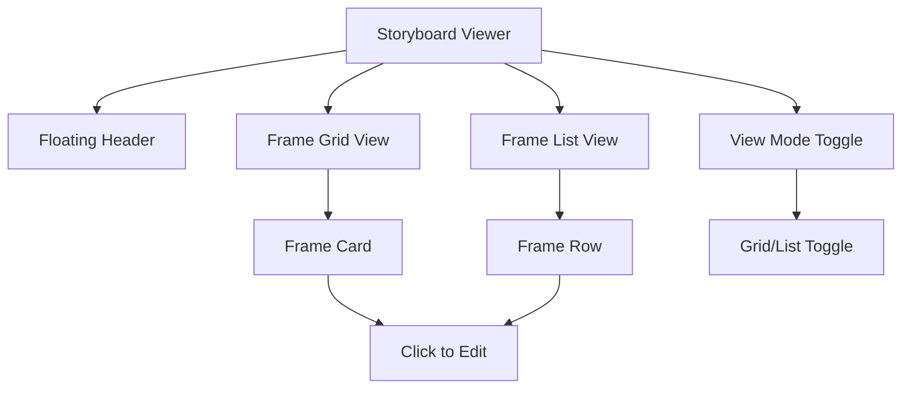
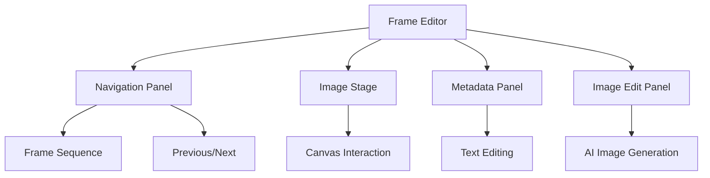
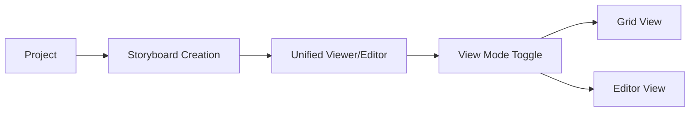
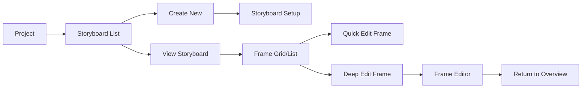
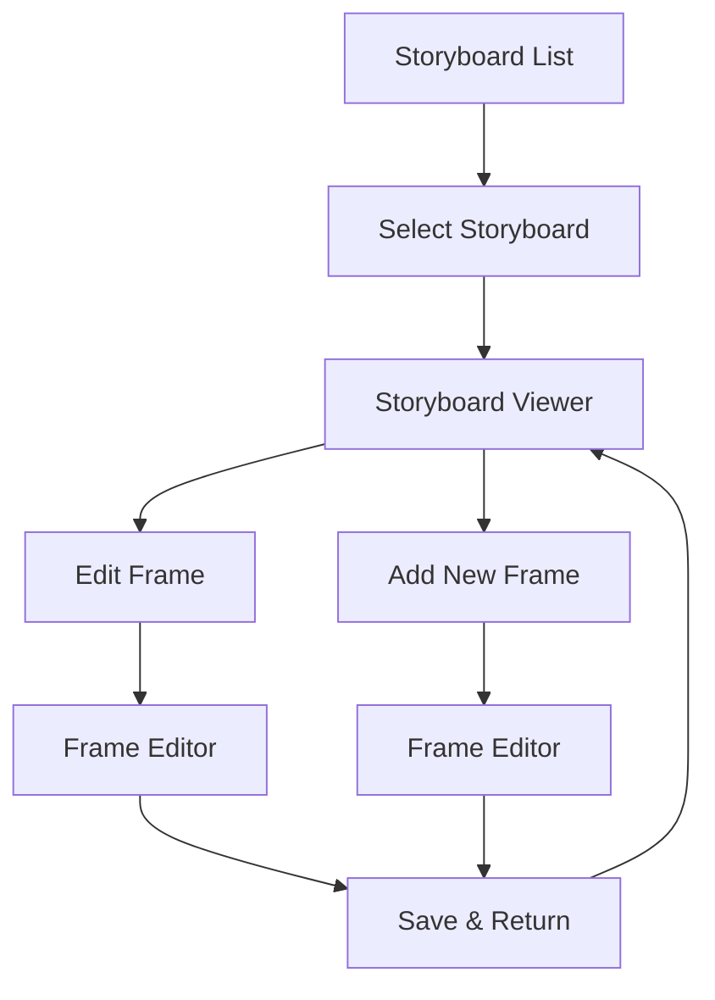

# Storyboard Page Structure Redesign

## 현재 상황 분석

### 기존 페이지 구조
현재 Blooma 프로젝트의 스토리보드 관련 페이지 구조는 다음과 같습니다:

```
/project/[id]/storyboard/
├── page.tsx (스토리보드 생성/선택 페이지)
└── [sbId]/
    └── page.tsx (통합 뷰어/에디터 페이지)
```

### 현재 구조의 문제점

#### 1. 단일 페이지에서의 복잡한 상태 관리
- `[sbId]/page.tsx`에서 grid view와 single editor를 `viewMode` 상태로 토글 관리
- 하나의 컴포넌트에서 두 가지 완전히 다른 UI 패턴을 처리
- 20.1KB의 대용량 파일로 유지보수성 저하

#### 2. UX 일관성 문제
- URL이 동일함에도 완전히 다른 인터페이스가 표시됨
- 브라우저 히스토리와 북마크 기능 제한
- 뒤로 가기 버튼의 모호한 동작

#### 3. 성능 및 로딩 이슈
- Grid view와 Editor view의 모든 코드가 동시에 로드
- 각각의 최적화된 로딩 전략 적용 불가
- SSE 연결 및 상태 동기화의 복잡성

## 제안된 개선 구조

### 새로운 페이지 구조

```
/project/[id]/storyboard/
├── page.tsx (스토리보드 리스트/그리드 뷰 전용)
├── [sbId]/
│   ├── page.tsx (스토리보드 뷰어 - Grid/List 뷰)
│   └── editor/
│       └── page.tsx (단일 프레임 에디터)
└── create/
    └── page.tsx (새 스토리보드 생성)
```

### 페이지별 역할 분리

#### 1. `/project/[id]/storyboard/page.tsx`
**목적**: 프로젝트 내 스토리보드 관리 및 개요


**주요 기능**:
- 프로젝트 내 모든 스토리보드 그리드 표시
- 스토리보드 생성, 삭제, 복제 기능
- 검색 및 필터링 옵션
- 스토리보드 메타데이터 관리

#### 2. `/project/[id]/storyboard/[sbId]/page.tsx`
**목적**: 스토리보드 전체 구조 조회 및 관리


**주요 기능**:
- Grid View: 전체 프레임을 카드 형태로 시각화
- List View: 텍스트 중심의 구조적 표시
- 프레임 순서 변경 (드래그 앤 드롭)
- 프레임 추가/삭제
- 전체 스토리보드 메타데이터 편집

#### 3. `/project/[id]/storyboard/[sbId]/editor/page.tsx`
**목적**: 개별 프레임의 집중적 편집


**주요 기능**:
- 단일 프레임 집중 편집 모드
- AI 이미지 생성 및 편집
- 상세 메타데이터 편집
- 프레임 간 네비게이션
- 실시간 미리보기

## 사용자 플로우 개선

### 기존 플로우


### 개선된 플로우


## 기술적 구현 방안

### 상태 관리 개선

#### 현재 상태 관리
```typescript
// 단일 페이지에서 복잡한 상태 관리
const [viewMode, setViewMode] = useState<'grid' | 'frame'>('grid')
const [frames, setFrames] = useState<StoryboardFrame[]>([])
const [index, setIndex] = useState(0)
```

#### 개선된 상태 관리
```typescript
// 페이지별 특화된 상태 관리
// Viewer 페이지
const viewerStore = {
  viewMode: 'grid' | 'list',
  frames: StoryboardFrame[],
  selectedFrames: string[]
}

// Editor 페이지
const editorStore = {
  currentFrameIndex: number,
  editingFrame: StoryboardFrame,
  unsavedChanges: boolean
}
```

### 라우팅 및 네비게이션

#### URL 구조
```
/project/123/storyboard                 # 스토리보드 리스트
/project/123/storyboard/456             # 스토리보드 뷰어
/project/123/storyboard/456/editor      # 에디터 (첫 번째 프레임)
/project/123/storyboard/456/editor?frame=3  # 특정 프레임 편집
```

#### 네비게이션 흐름


## 컴포넌트 재사용성

### 공통 컴포넌트 추출
```typescript
// 공통 컴포넌트
components/storyboard/
├── FloatingHeader.tsx      # 모든 페이지에서 재사용
├── FrameCard.tsx          # Grid view, List view에서 재사용
├── FrameSequence.tsx      # Editor의 네비게이션에서 재사용
├── StoryboardMetadata.tsx # 메타데이터 편집
└── ViewModeToggle.tsx     # Grid/List 토글
```

### 페이지별 특화 컴포넌트
```typescript
// 뷰어 페이지 전용
components/storyboard/viewer/
├── FrameGrid.tsx
├── FrameList.tsx
└── BulkActions.tsx

// 에디터 페이지 전용
components/storyboard/editor/
├── ImageStage.tsx
├── MetadataPanel.tsx
├── ImageEditPanel.tsx
└── SequencePanel.tsx
```

## 성능 최적화

### 코드 분할
```typescript
// 페이지별 lazy loading
const StoryboardViewer = lazy(() => import('./viewer/page'))
const FrameEditor = lazy(() => import('./editor/page'))
```

### 데이터 로딩 최적화
```typescript
// 뷰어: 메타데이터 중심 로딩
const viewerQuery = {
  select: 'id, title, scene_number, status, thumbnail_url',
  order: 'order_index'
}

// 에디터: 상세 데이터 로딩
const editorQuery = {
  select: '*',
  single: true
}
```

## 개발 단계별 마이그레이션 계획

### Phase 1: 에디터 분리
1. `/editor/page.tsx` 생성
2. 기존 single editor 로직 이전
3. 라우팅 연결 및 테스트

### Phase 2: 뷰어 정리
1. 기존 `[sbId]/page.tsx`에서 editor 로직 제거
2. Grid/List view 최적화
3. 네비게이션 업데이트

### Phase 3: 컴포넌트 최적화
1. 공통 컴포넌트 추출
2. 성능 최적화 적용
3. UX 개선사항 적용

## 예상 효과

### 개발자 경험 개선
- **코드 가독성**: 페이지당 파일 크기 50% 이상 감소
- **유지보수성**: 기능별 명확한 책임 분리
- **디버깅**: 페이지별 독립적인 상태 관리

### 사용자 경험 개선
- **성능**: 필요한 코드만 로드하여 초기 로딩 시간 단축
- **직관성**: URL과 기능의 명확한 대응
- **네비게이션**: 브라우저 히스토리 활용 가능

### 확장성 개선
- **새 기능 추가**: 페이지별 독립적 개발 가능
- **A/B 테스팅**: 개별 페이지 실험 용이
- **국제화**: 페이지별 특화된 콘텐츠 관리

## 결론

제안해주신 페이지 분리 아이디어는 현재 시스템의 복잡성을 해결하고 더 나은 사용자 경험을 제공할 수 있는 효과적인 접근법입니다. 특히 관심사의 분리, 성능 최적화, 유지보수성 향상 측면에서 상당한 이점을 가져올 것으로 예상됩니다.