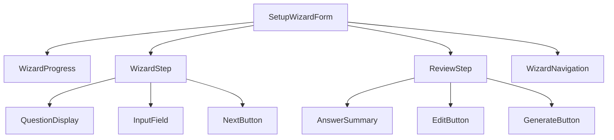
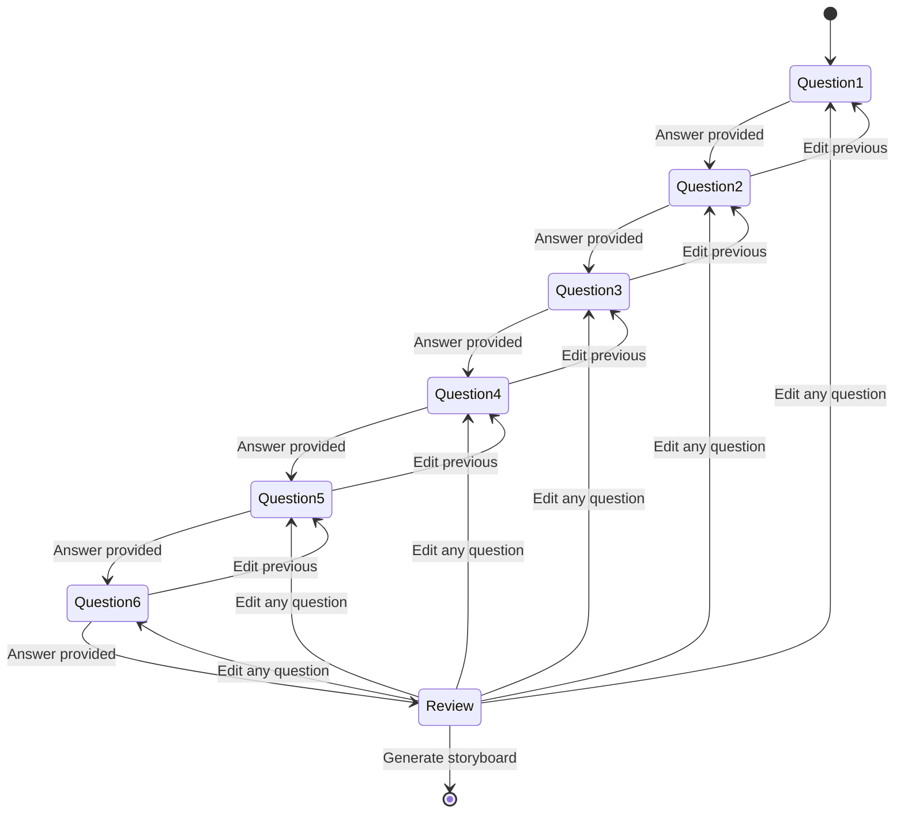
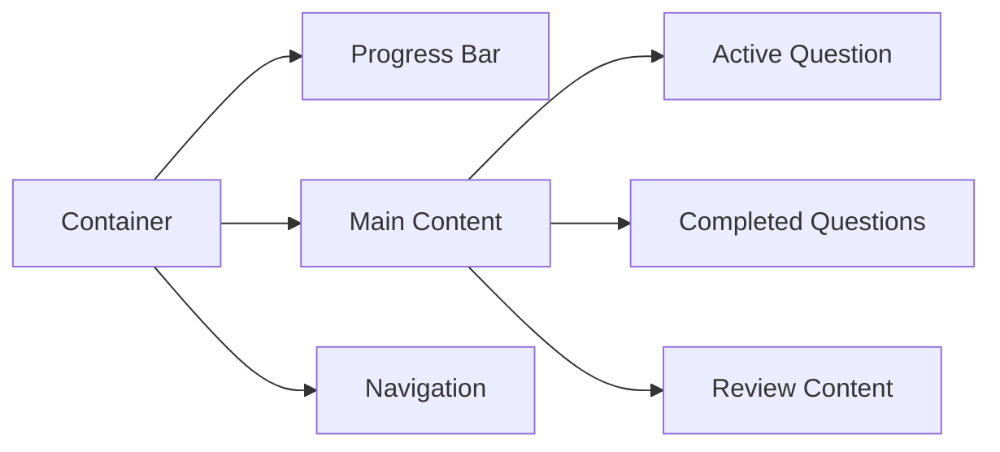

# Setup Page Wizard Form Design

## Overview

This document outlines the design for a multi-step wizard form that replaces the existing setup page in the Blooma project. The wizard will guide users through 6 sequential questions to collect project parameters for storyboard generation.

## Architecture

### Component Structure



### State Management



## Component Specifications

### SetupWizardForm Component

Main container component managing the entire wizard flow.

#### Props Interface
```typescript
interface SetupWizardFormProps {
  id?: string
  onComplete?: (data: WizardFormData) => void
}
```

#### State Interface
```typescript
interface WizardState {
  currentStep: number
  answers: Record<string, string>
  isComplete: boolean
  isGenerating: boolean
}

interface WizardFormData {
  projectPurpose: string
  targetAudience: string
  desiredTone: string
  frameCount: string
  backgroundDescription: string
  generateModel: string
}
```

### WizardProgress Component

Visual progress indicator showing current step and completed steps.

#### Visual Design
- Progress bar with 6 segments plus review step
- Current step highlighted in green
- Completed steps in dark green
- Pending steps in neutral gray
- Step numbers displayed within circles

### WizardStep Component

Container for individual question steps.

#### Props Interface
```typescript
interface WizardStepProps {
  questionNumber: number
  question: string
  placeholder: string
  value: string
  isActive: boolean
  isCompleted: boolean
  onValueChange: (value: string) => void
  onNext: () => void
  onEdit: () => void
}
```

#### Visual States
- **Active**: Question and input field enabled, background highlighted
- **Completed**: Question and answer displayed, edit button visible, grayed out
- **Pending**: Hidden or minimally visible

### ReviewStep Component

Final step showing all questions and answers with edit capabilities.

#### Props Interface
```typescript
interface ReviewStepProps {
  answers: Record<string, string>
  questions: QuestionConfig[]
  onEdit: (stepNumber: number) => void
  onGenerate: () => void
  isGenerating: boolean
}
```

## Question Configuration

### Question List
```typescript
const WIZARD_QUESTIONS: QuestionConfig[] = [
  {
    id: 'projectPurpose',
    number: 1,
    question: 'What is the purpose of your project?',
    placeholder: 'Describe the main goal or objective of your storyboard...',
    type: 'textarea'
  },
  {
    id: 'targetAudience',
    number: 2,
    question: 'Who is your target audience?',
    placeholder: 'Describe your intended viewers or customers...',
    type: 'textarea'
  },
  {
    id: 'desiredTone',
    number: 3,
    question: 'What is your desired mood/tone?',
    placeholder: 'Professional, casual, playful, serious, etc...',
    type: 'input'
  },
  {
    id: 'frameCount',
    number: 4,
    question: 'How many frames would you like?',
    placeholder: '6-12 frames recommended...',
    type: 'input'
  },
  {
    id: 'backgroundDescription',
    number: 5,
    question: 'Describe your desired background or setting?',
    placeholder: 'Office environment, outdoor nature, studio setup, etc...',
    type: 'textarea'
  },
  {
    id: 'generateModel',
    number: 6,
    question: 'Would you like to generate a model?',
    placeholder: 'Not yet implemented - future feature...',
    type: 'input'
  }
]
```

### QuestionConfig Interface
```typescript
interface QuestionConfig {
  id: string
  number: number
  question: string
  placeholder: string
  type: 'input' | 'textarea' | 'select'
  options?: string[]
}
```

## Design System

### Color Scheme
- **Primary Background**: `bg-neutral-900`
- **Card Background**: `bg-neutral-800`
- **Border**: `border-neutral-700`
- **Text Primary**: `text-white`
- **Text Secondary**: `text-neutral-300`
- **Text Muted**: `text-neutral-400`
- **Success/Active**: `bg-green-600`, `text-green-400`
- **Progress Complete**: `bg-green-700`
- **Hover States**: `hover:bg-neutral-700`

### Layout Structure


### Responsive Design
- **Desktop**: Single column layout with maximum width
- **Tablet**: Maintain single column with adjusted spacing
- **Mobile**: Stack elements vertically with full width

## User Interaction Flow

### Step Navigation
1. User enters answer in active question
2. Next button becomes enabled when answer is provided
3. Click next button to advance to next question
4. Previous questions become inactive but visible with answers
5. Edit button allows returning to modify previous answers

### Answer Validation
- All questions require non-empty answers
- Frame count question should validate for numeric input
- Maximum character limits for textarea fields

### Auto-save Functionality
- Save draft answers to localStorage on each change
- Restore answers on page reload
- Clear draft after successful storyboard generation

## Technical Implementation

### File Structure
```
src/components/project/wizard/
├── SetupWizardForm.tsx
├── WizardProgress.tsx
├── WizardStep.tsx
├── ReviewStep.tsx
├── WizardNavigation.tsx
└── types.ts
```

### State Management
- Use React useState for local component state
- Implement custom hook for wizard logic
- Integration with existing Zustand stores if needed

### API Integration
- Transform wizard answers into existing storyboard generation payload
- Maintain compatibility with current `/api/storyboard/build` endpoint
- Include all collected parameters in generation request

### TypeScript Types
```typescript
// Wizard-specific types
type WizardStep = 1 | 2 | 3 | 4 | 5 | 6 | 'review'

interface WizardAnswer {
  questionId: string
  value: string
  timestamp: Date
}

interface WizardFormState {
  currentStep: WizardStep
  answers: Map<string, WizardAnswer>
  isValid: boolean
  isDirty: boolean
}

// Integration with existing types
interface StoryboardGenerationPayload extends BuildStoryboardOptions {
  projectPurpose: string
  targetAudience: string
  desiredTone: string
  frameCount: number
  backgroundDescription: string
  generateModel: boolean
}
```

## Integration Points

### Existing Components
- Replace current `SetupForm` component usage
- Maintain same props interface for backwards compatibility
- Preserve existing API integration patterns

### Data Transformation
```typescript
const transformWizardDataToStoryboard = (
  wizardData: WizardFormData,
  projectId: string
): BuildStoryboardOptions => {
  return {
    projectId,
    script: generateScriptFromAnswers(wizardData),
    visualStyle: 'photo', // Default or derived from answers
    ratio: '16:9', // Default or user preference
    mode: 'async',
    aiModel: 'fal-ai/flux-1/schnell' // Default model
  }
}
```

### Script Generation
Transform wizard answers into narrative script format:
```typescript
const generateScriptFromAnswers = (data: WizardFormData): string => {
  return `
Project Purpose: ${data.projectPurpose}
Target Audience: ${data.targetAudience}
Desired Tone: ${data.desiredTone}
Frame Count: ${data.frameCount}
Background/Setting: ${data.backgroundDescription}
Model Generation: ${data.generateModel}
  `.trim()
}
```

## Accessibility Features

### Keyboard Navigation
- Tab order follows logical step sequence
- Enter key advances to next step when valid
- Escape key cancels current edit operation

### Screen Reader Support
- Proper ARIA labels for all form elements
- Progress indicator announced on step changes
- Form validation errors clearly announced

### Focus Management
- Auto-focus on active question input
- Maintain focus context when editing previous answers
- Clear focus indicators throughout interface

## Testing Strategy

### Unit Testing
- Individual component rendering and state management
- Question validation logic
- Data transformation utilities

### Integration Testing
- Full wizard flow completion
- Edit functionality for previous answers
- Auto-save and restore capabilities

### User Acceptance Testing
- Complete wizard flow with various answer combinations
- Navigation between steps and edit operations
- Final storyboard generation with collected data
