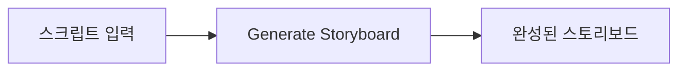
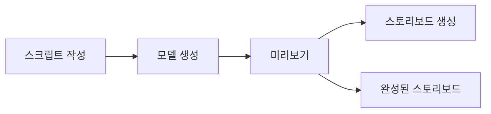
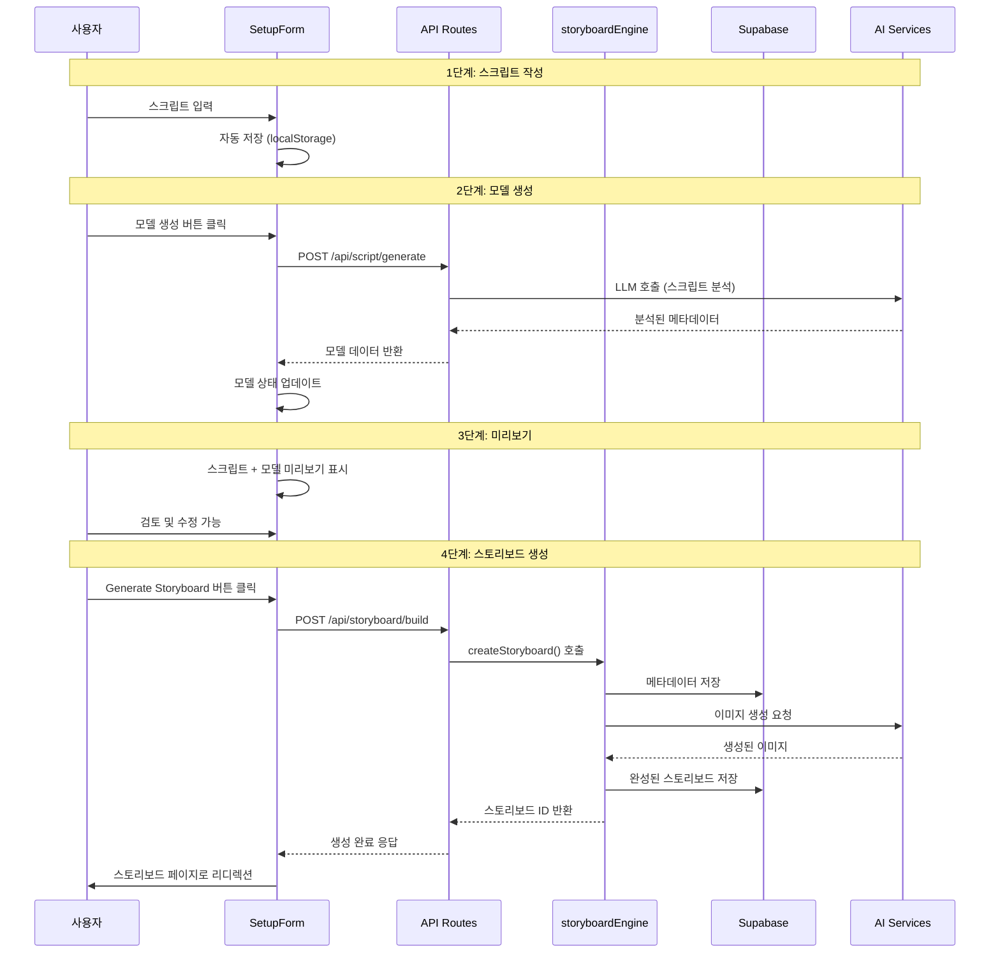
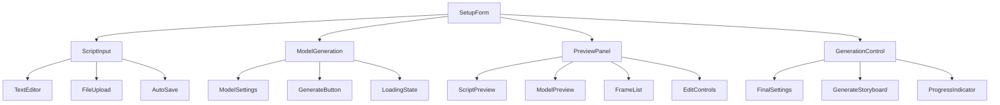
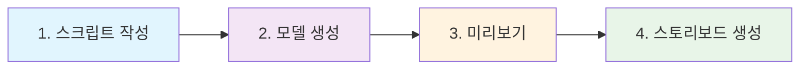
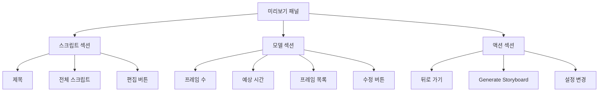

# 스토리보드 플로우 분할 설계

## 개요

현재 스토리보드 생성은 스크립트 입력 후 즉시 전체 스토리보드를 생성하는 단일 단계 플로우로 구성되어 있습니다. 이를 사용자가 각 단계를 검토하고 제어할 수 있는 4단계 플로우로 개선하여 더 나은 사용자 경험과 제어력을 제공합니다.

### 현재 플로우 (AS-IS)


### 개선된 플로우 (TO-BE)


## 기술 스택

- **Frontend**: Next.js 15, React 19, TypeScript
- **State Management**: Zustand
- **Styling**: Tailwind CSS v4
- **Backend**: Supabase (PostgreSQL)
- **AI Integration**: OpenRouter, FAL AI, Replicate

## 아키텍처 설계

### 전체 플로우 아키텍처


## 데이터 모델

### 스크립트 모델 (Script Model)
```typescript
interface ScriptData {
  content: string;
  title?: string;
  estimatedFrames?: number;
  createdAt: Date;
  updatedAt: Date;
}
```

### 생성된 모델 (Generated Model)
```typescript
interface GeneratedModel {
  id: string;
  scriptId: string;
  frames: Array<{
    id: string;
    sequence: number;
    description: string;
    dialogue?: string;
    cameraAngle?: string;
    mood?: string;
    estimatedDuration?: number;
  }>;
  metadata: {
    totalFrames: number;
    estimatedDuration: number;
    visualStyle: string;
    tone: string;
  };
  status: 'draft' | 'ready' | 'error';
  createdAt: Date;
}
```

### 미리보기 상태 (Preview State)
```typescript
interface PreviewState {
  script: ScriptData;
  model: GeneratedModel;
  isEditable: boolean;
  hasChanges: boolean;
  validationErrors: string[];
}
```

## 컴포넌트 아키텍처

### 기존 SetupForm 컴포넌트 개선


### 단계별 UI 상태 관리
```typescript
interface FlowState {
  currentStep: 'script' | 'model' | 'preview' | 'generation';
  scriptData: ScriptData | null;
  generatedModel: GeneratedModel | null;
  previewState: PreviewState | null;
  isLoading: boolean;
  errors: Record<string, string>;
}
```

## API 엔드포인트 설계

### 기존 API 수정 및 신규 API 추가

#### 1. 스크립트 분석 API (기존 개선)
```typescript
// POST /api/script/analyze
interface AnalyzeRequest {
  script: string;
  projectId: string;
  settings?: {
    visualStyle?: string;
    targetAudience?: string;
    tone?: string;
  };
}

interface AnalyzeResponse {
  model: GeneratedModel;
  suggestions?: string[];
  warnings?: string[];
}
```

#### 2. 모델 저장 API (신규)
```typescript
// POST /api/models
interface SaveModelRequest {
  projectId: string;
  scriptData: ScriptData;
  generatedModel: GeneratedModel;
}

interface SaveModelResponse {
  modelId: string;
  status: 'saved' | 'error';
}
```

#### 3. 모델 조회 API (신규)
```typescript
// GET /api/models/:modelId
interface GetModelResponse {
  model: GeneratedModel;
  script: ScriptData;
  createdAt: Date;
  updatedAt: Date;
}
```

#### 4. 스토리보드 생성 API (기존 개선)
```typescript
// POST /api/storyboard/build
interface BuildStoryboardRequest {
  modelId: string; // 기존 script 대신 modelId 사용
  projectId: string;
  settings: {
    visualStyle: string;
    ratio: string;
    aiModel: string;
    isAsync?: boolean;
  };
}
```

## 상태 관리 설계

### Zustand 스토어 구조
```typescript
interface StoryboardFlowStore {
  // 현재 플로우 상태
  currentStep: FlowStep;
  
  // 각 단계 데이터
  scriptData: ScriptData | null;
  generatedModel: GeneratedModel | null;
  previewState: PreviewState | null;
  
  // 로딩 상태
  isGeneratingModel: boolean;
  isGeneratingStoryboard: boolean;
  
  // 액션
  setCurrentStep: (step: FlowStep) => void;
  updateScript: (script: ScriptData) => void;
  generateModel: (scriptData: ScriptData) => Promise<GeneratedModel>;
  updateModel: (model: GeneratedModel) => void;
  generateStoryboard: (modelId: string, settings: any) => Promise<string>;
  
  // 유틸리티
  canProceedToNext: () => boolean;
  resetFlow: () => void;
  saveProgress: () => void;
}
```

## 사용자 인터페이스 설계

### 단계별 진행 표시기


### 미리보기 패널 레이아웃


## 데이터베이스 스키마 변경

### 신규 테이블: script_models
```sql
CREATE TABLE script_models (
  id UUID PRIMARY KEY DEFAULT gen_random_uuid(),
  project_id UUID NOT NULL REFERENCES projects(id) ON DELETE CASCADE,
  script_content TEXT NOT NULL,
  script_title TEXT,
  model_data JSONB NOT NULL,
  metadata JSONB DEFAULT '{}',
  status TEXT DEFAULT 'draft' CHECK (status IN ('draft', 'ready', 'error')),
  created_at TIMESTAMP WITH TIME ZONE DEFAULT NOW(),
  updated_at TIMESTAMP WITH TIME ZONE DEFAULT NOW()
);

CREATE INDEX idx_script_models_project_id ON script_models(project_id);
CREATE INDEX idx_script_models_status ON script_models(status);
```

### 기존 storyboards 테이블 수정
```sql
-- 모델 참조 추가
ALTER TABLE storyboards 
ADD COLUMN script_model_id UUID REFERENCES script_models(id);

-- 기존 script 컬럼은 deprecated 처리 (향후 삭제 예정)
ALTER TABLE storyboards 
ADD COLUMN legacy_script TEXT;
```

## 구현 단계

### Phase 1: 기본 플로우 구조 구축
1. **UI 컴포넌트 분리**
   - ScriptInputStep 컴포넌트 생성
   - ModelGenerationStep 컴포넌트 생성
   - PreviewStep 컴포넌트 생성
   - GenerationStep 컴포넌트 생성

2. **상태 관리 구현**
   - StoryboardFlowStore 구현
   - 단계별 상태 전환 로직 구현

3. **API 엔드포인트 구현**
   - /api/script/analyze 구현
   - /api/models CRUD 구현

### Phase 2: 미리보기 및 편집 기능
1. **미리보기 인터페이스**
   - 스크립트 + 모델 통합 미리보기
   - 실시간 편집 기능
   - 변경사항 추적

2. **모델 수정 기능**
   - 프레임 추가/삭제
   - 프레임 순서 변경
   - 메타데이터 수정

### Phase 3: 최적화 및 사용자 경험 개선
1. **성능 최적화**
   - 모델 생성 속도 개선
   - 캐싱 전략 구현
   - 점진적 로딩

2. **사용자 경험 개선**
   - 진행 상황 표시
   - 오류 처리 개선
   - 도움말 및 가이드

## 성능 고려사항

### 모델 생성 최적화
- **캐싱 전략**: 동일한 스크립트에 대한 모델 재사용
- **배치 처리**: 여러 프레임을 동시에 분석
- **점진적 로딩**: 큰 스크립트를 청크 단위로 처리

### 상태 관리 최적화
- **메모이제이션**: React.memo와 useMemo 활용
- **상태 분할**: 각 단계별 독립적인 상태 관리
- **지연 로딩**: 필요한 시점에만 데이터 로드

## 보안 고려사항

### 데이터 보호
- **입력 검증**: 스크립트 내용 XSS 방지
- **접근 제어**: 사용자별 모델 접근 권한 관리
- **데이터 암호화**: 민감한 스크립트 내용 암호화

### API 보안
- **Rate Limiting**: 모델 생성 API 호출 빈도 제한
- **인증 검증**: 모든 API 엔드포인트에 인증 필수
- **입력 크기 제한**: 과도한 스크립트 길이 방지

## 테스팅 전략

### 단위 테스트
- 각 단계별 컴포넌트 테스트
- 상태 관리 로직 테스트
- API 엔드포인트 테스트

### 통합 테스트
- 전체 플로우 시나리오 테스트
- 데이터베이스 연동 테스트
- AI 서비스 통합 테스트

### 사용자 테스트
- 플로우 사용성 테스트
- 성능 벤치마크 테스트
- 다양한 스크립트 타입 테스트