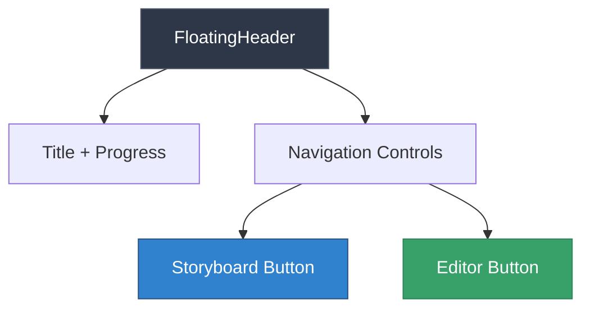
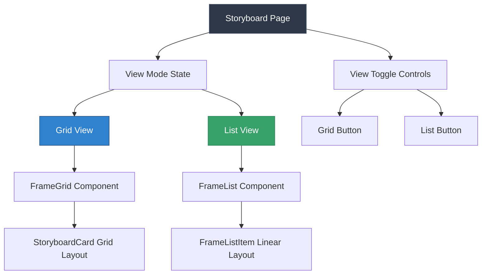
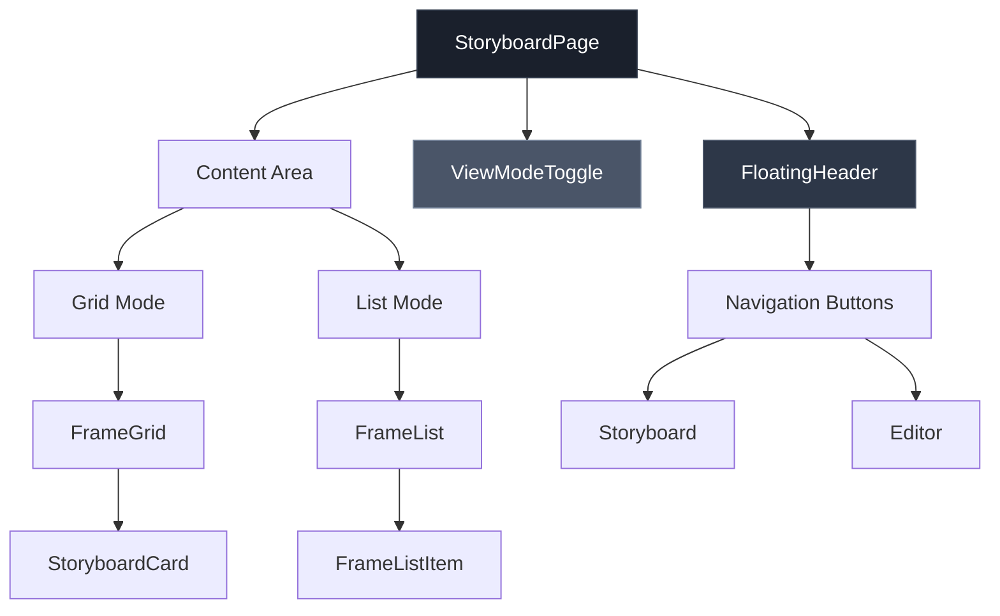
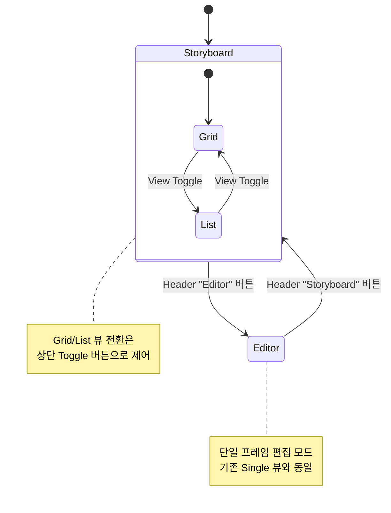
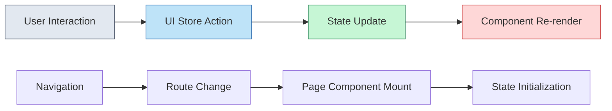
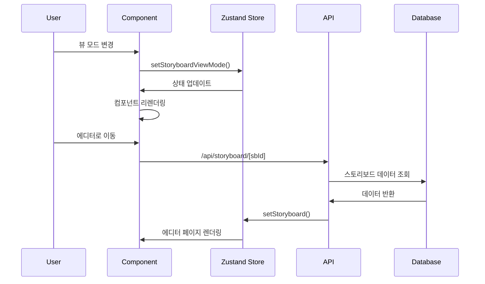
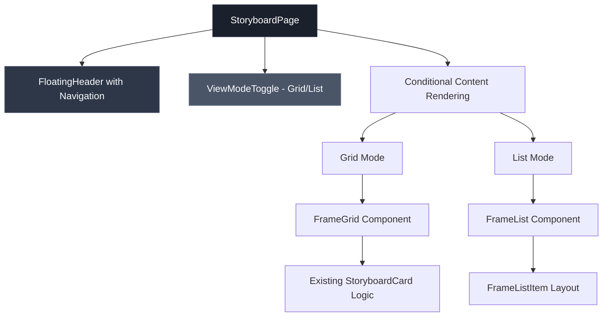

# View Switching Feature Design

## Overview

이 설계는 Blooma 스토리보드 시스템의 뷰 전환 기능을 재구성하는 것입니다. 현재 Grid/Single 뷰 시스템을 Storyboard/Editor로 재구성하고, Storyboard 내에서 Grid/List 뷰 전환 기능을 추가하여 사용자 경험을 개선합니다.

### 핵심 변경사항
- Header의 역할을 스토리보드와 에디터 간 이동으로 변경
- 스토리보드 페이지에서 Grid/List 뷰 전환 버튼 추가
- Single 뷰를 Editor로 명명 변경
- 기존 editor 페이지의 기능을 Single 뷰로 마이그레이션

## Technology Stack & Dependencies

### Frontend Framework
- **Next.js 15**: App Router를 사용한 파일 기반 라우팅
- **React 19**: 컴포넌트 상태 관리 및 렌더링
- **TypeScript**: 타입 안전성 보장

### State Management
- **Zustand**: 글로벌 상태 관리
  - `useStoryboardStore`: 스토리보드 및 카드 데이터 관리
  - `useUIStore`: UI 상태 (모달, 뷰 모드) 관리

### UI Components
- **Tailwind CSS v4**: 스타일링
- **Lucide React**: 아이콘 라이브러리
- **@radix-ui**: 접근 가능한 UI 컴포넌트

## Component Architecture

### 1. Navigation Header 재구성



### 2. Storyboard View 시스템



### 3. Component Hierarchy



## Routing & Navigation

### URL 구조
- **Storyboard 뷰**: `/project/[id]/storyboard/[sbId]`
- **Editor 뷰**: `/project/[id]/storyboard/[sbId]/editor`

### Navigation Flow



## State Management Architecture

### 1. UI Store 확장

```typescript
interface UIState {
  // 기존 상태
  isNewProjectModalOpen: boolean
  selectedProjectId: string | null
  
  // 새로 추가될 상태
  storyboardViewMode: 'grid' | 'list'
  currentView: 'storyboard' | 'editor'
  
  // Actions
  setStoryboardViewMode: (mode: 'grid' | 'list') => void
  setCurrentView: (view: 'storyboard' | 'editor') => void
}
```

### 2. 상태 흐름



## API Integration Layer

### 기존 API 엔드포인트 활용
- **GET** `/api/storyboards`: 스토리보드 목록 조회
- **GET** `/api/cards`: 카드 데이터 조회
- **PUT** `/api/cards`: 카드 업데이트
- **DELETE** `/api/cards`: 카드 삭제

### 데이터 흐름



## Testing Strategy

### Unit Testing
- **ViewModeToggle** 컴포넌트 테스트
  - Grid/List 뷰 전환 기능
  - 버튼 상태 변경 확인
- **FloatingHeader** 컴포넌트 테스트
  - Navigation 버튼 동작
  - 활성 상태 표시 확인

### Integration Testing
- **Storyboard → Editor** 네비게이션 테스트
- **Grid ↔ List** 뷰 전환 테스트
- **상태 지속성** 테스트 (페이지 새로고침 시)

### E2E Testing
```typescript
// Playwright 테스트 시나리오
test('스토리보드 뷰 전환 기능', async ({ page }) => {
  // 1. 스토리보드 페이지 접근
  await page.goto('/project/test-id/storyboard/sb-id')
  
  // 2. Grid 뷰에서 List 뷰로 전환
  await page.click('[data-testid="list-view-button"]')
  await expect(page.locator('[data-testid="frame-list"]')).toBeVisible()
  
  // 3. Editor로 이동
  await page.click('[data-testid="editor-nav-button"]')
  await expect(page).toHaveURL(/\/editor/)
  
  // 4. Storyboard로 돌아가기
  await page.click('[data-testid="storyboard-nav-button"]')
  await expect(page).toHaveURL(/\/storyboard/)
})
```

## Implementation Details

### 1. FloatingHeader 컴포넌트 수정

```typescript
interface FloatingHeaderProps {
  title: string
  index: number
  total: number
  currentView: 'storyboard' | 'editor'
  onNavigateToStoryboard: () => void
  onNavigateToEditor: () => void
  // 스토리보드 뷰에서만 사용
  viewMode?: 'grid' | 'list'
  onSetGrid?: () => void
  onSetList?: () => void
}
```

### 2. ViewModeToggle 컴포넌트 업데이트

현재 Grid/List 토글을 위한 전용 컴포넌트가 이미 존재하므로, 이를 재사용합니다:

```typescript
// 기존 ViewModeToggle.tsx 활용
<ViewModeToggle
  viewMode={viewMode}
  onSetGrid={() => setViewMode('grid')}
  onSetList={() => setViewMode('list')}
  className="mb-4"
/>
```

### 3. 스토리보드 페이지 레이아웃 재구성



### 4. 라우팅 및 네비게이션 로직

```typescript
// 네비게이션 핸들러
const handleNavigateToEditor = () => {
  router.push(`/project/${projectId}/storyboard/${sbId}/editor`)
}

const handleNavigateToStoryboard = () => {
  router.push(`/project/${projectId}/storyboard/${sbId}`)
}
```

### 5. Editor 페이지 기능 마이그레이션

기존 `/editor/page.tsx`의 기능을 메인 스토리보드 페이지의 "frame" 모드로 통합:

- **URL 파라미터 관리**: `?frame=1` 형태로 현재 프레임 추적
- **키보드 네비게이션**: 좌우 화살표로 프레임 이동
- **SingleEditorLayout**: 3패널 편집 레이아웃 유지
- **이미지 편집 기능**: ImageEditPanel 통합

## Data Models & State Management

### UI State 확장

```typescript
interface UIStore {
  // 기존 상태
  isNewProjectModalOpen: boolean
  selectedProjectId: string | null
  
  // 새로 추가
  storyboardViewMode: 'grid' | 'list'
  
  // Actions
  setStoryboardViewMode: (mode: 'grid' | 'list') => void
  toggleStoryboardViewMode: () => void
}
```

### 상태 지속성

```typescript
// localStorage를 통한 뷰 모드 기억
const STORAGE_KEY = 'blooma_storyboard_view_mode'

const persistViewMode = (mode: 'grid' | 'list') => {
  localStorage.setItem(STORAGE_KEY, mode)
}

const getPersistedViewMode = (): 'grid' | 'list' => {
  return localStorage.getItem(STORAGE_KEY) as 'grid' | 'list' || 'grid'
}
```

## Performance Considerations

### 1. 컴포넌트 최적화
- **React.memo**: FrameGrid, FrameList 컴포넌트 메모이제이션
- **useMemo**: 대용량 프레임 데이터 정렬 최적화
- **useCallback**: 이벤트 핸들러 안정화

### 2. 렌더링 최적화
```typescript
// 가상화된 리스트 뷰 (대용량 스토리보드용)
const MemoizedFrameList = React.memo(FrameList)
const MemoizedFrameGrid = React.memo(FrameGrid)

// 조건부 렌더링 최적화
const ContentRenderer = useMemo(() => {
  return viewMode === 'grid' ? 
    <MemoizedFrameGrid {...gridProps} /> : 
    <MemoizedFrameList {...listProps} />
}, [viewMode, gridProps, listProps])
```

### 3. 이미지 로딩 최적화
- **Lazy Loading**: 뷰포트 밖 이미지 지연 로딩
- **Image Placeholder**: 로딩 중 스켈레톤 UI
- **Progressive Enhancement**: 저해상도 → 고해상도 이미지 로딩

## Accessibility & User Experience

### 키보드 네비게이션
```typescript
// 접근성 지원 키보드 단축키
const useKeyboardNavigation = () => {
  useEffect(() => {
    const handleKeyPress = (e: KeyboardEvent) => {
      if (e.metaKey || e.ctrlKey) {
        switch(e.key) {
          case '1':
            setViewMode('grid')
            break
          case '2':
            setViewMode('list')
            break
          case 'e':
            navigateToEditor()
            break
          case 's':
            navigateToStoryboard()
            break
        }
      }
    }
    
    window.addEventListener('keydown', handleKeyPress)
    return () => window.removeEventListener('keydown', handleKeyPress)
  }, [])
}
```

### ARIA 지원
```typescript
// 스크린 리더 지원
<div 
  role="tabpanel" 
  aria-label={`${viewMode} view of storyboard`}
  aria-live="polite"
>
  {/* 컨텐츠 */}
</div>

<button 
  aria-pressed={viewMode === 'grid'}
  aria-label="Switch to grid view"
  onClick={onSetGrid}
>
  Grid
</button>
```

## Migration Strategy

### Phase 1: 컴포넌트 준비
1. FloatingHeader 컴포넌트 수정
2. ViewModeToggle 위치 조정
3. FrameGrid, FrameList 컴포넌트 검증

### Phase 2: 라우팅 업데이트
1. 네비게이션 로직 구현
2. URL 파라미터 관리 개선
3. 브라우저 히스토리 처리

### Phase 3: 상태 관리 통합
1. UI Store 확장
2. 상태 지속성 구현
3. 기존 상태와의 호환성 확보

### Phase 4: 기능 통합
1. Editor 페이지 기능 마이그레이션
2. 단일 페이지에서 모든 뷰 모드 지원
3. 기존 API 호출 최적화

### Phase 5: 테스트 및 최적화
1. 단위 테스트 작성
2. E2E 테스트 시나리오 구현
3. 성능 최적화 적용
4. 접근성 검증

## Risk Assessment

### 기술적 위험
1. **상태 동기화 이슈**: 여러 뷰 모드 간 상태 불일치
   - **완화책**: 단일 상태 소스 원칙 적용

2. **성능 저하**: 대용량 스토리보드 렌더링 지연
   - **완화책**: 가상화 및 지연 로딩 구현

3. **라우팅 복잡성**: URL 상태와 컴포넌트 상태 불일치
   - **완화책**: 명확한 라우팅 규칙 정의

### 사용자 경험 위험
1. **학습 곡선**: 새로운 네비게이션 패턴 적응
   - **완화책**: 명확한 시각적 표시 및 툴팁 제공

2. **기능 발견**: 새로운 뷰 전환 기능 인지 부족
   - **완화책**: 온보딩 가이드 및 키보드 단축키 안내