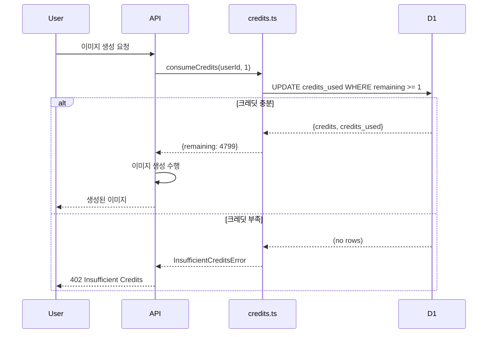

# Blooma 결제 및 크레딧 시스템 상세 레퍼런스

> **작성일**: 2025-12-15  
> **버전**: 1.0 (PR-1~5 적용 후)

---

## 목차
1. [파일 구조](#파일-구조)
2. [플랜 정의](#플랜-정의)
3. [크레딧 시스템](#크레딧-시스템)
4. [구독 관리](#구독-관리)
5. [웹훅 처리](#웹훅-처리)
6. [API 엔드포인트 상세](#api-엔드포인트-상세)
7. [프론트엔드 컴포넌트](#프론트엔드-컴포넌트)

---

## 파일 구조

```
src/
├── app/api/
│   ├── billing/
│   │   ├── checkout/route.ts     # 체크아웃 세션 생성
│   │   ├── status/route.ts       # 구독 상태 조회
│   │   └── webhook/route.ts      # Polar 웹훅 (550+ lines)
│   └── user/
│       └── credits/route.ts      # 크레딧 조회
├── components/
│   ├── billing/                  # 결제 UI 컴포넌트
│   ├── NotEnoughCreditModal.tsx  # 크레딧 부족 모달
│   └── ui/CreditsIndicator.tsx   # 크레딧 표시기
├── hooks/
│   ├── useHandleCreditError.ts   # 크레딧 에러 핸들링
│   └── useUserCredits.ts         # 크레딧 조회 훅
└── lib/
    ├── billing/
    │   ├── plans.ts              # 플랜 ↔ Product ID 매핑
    │   └── subscription.ts       # hasActiveSubscription()
    ├── db/
    │   ├── users.ts              # 사용자 CRUD + 구독 업데이트
    │   └── webhookEvents.ts      # 웹훅 멱등성
    ├── customerportal/
    │   └── route.ts              # 고객 포털 세션
    ├── credits.ts                # 크레딧 소비/환불
    └── credits-utils.ts          # 크레딧 비용 계산
```

---

## 플랜 정의

### 파일: `src/lib/billing/plans.ts`

| 플랜 | 가격 | 월간 크레딧 | Product ID 환경변수 |
|------|------|------------|---------------------|
| **Starter** | $19/월 | 2,200 | `POLAR_BLOOMA_STARTER_PRODUCT_ID` |
| **Pro** | $49/월 | 6,000 | `POLAR_BLOOMA_PRO_PRODUCT_ID` |
| **Studio** | $99/월 | 13,000 | `POLAR_BLOOMA_STUDIO_PRODUCT_ID` |

### 주요 함수

```typescript
// 타입
type PlanId = 'Starter' | 'Pro' | 'Studio'

// 플랜 ID → Polar Product ID
getProductIdForPlan(planId: PlanId): string

// Polar Product ID → 플랜 ID
getPlanIdForProductId(productId: string): PlanId | undefined

// 플랜별 크레딧 수
getCreditsForPlan(planId: PlanId): number
// Starter: 2200, Pro: 6000, Studio: 13000
```

---

## 크레딧 시스템

### 파일: `src/lib/credits.ts`

#### 핵심 함수

| 함수 | 용도 | 반환값 |
|------|------|--------|
| `ensureCredits(userId, required)` | 크레딧 잔액 확인 | `{ total, used, remaining }` |
| `consumeCredits(userId, amount)` | 크레딧 차감 (원자적) | `{ total, used, remaining }` |
| `refundCredits(userId, amount)` | 크레딧 환불 | `{ total, used, remaining }` |
| `withCreditConsumption(userId, amount, job, shouldRefund?)` | 작업 래핑 (실패 시 자동 환불) | `<T>` |

#### consumeCredits 동작

```sql
-- 원자적 업데이트 (조건부)
UPDATE users
SET credits_used = COALESCE(credits_used, 0) + ?amount
WHERE id = ?userId
  AND (COALESCE(credits, 0) - COALESCE(credits_used, 0)) >= ?amount
RETURNING credits, credits_used
```

- 잔액 부족 시 `InsufficientCreditsError` 발생
- SQL 레벨에서 원자성 보장

#### withCreditConsumption 패턴

```typescript
// 사용 예시
const result = await withCreditConsumption(
  userId,
  creditCost,
  async () => await generateImage(...),
  (result) => result.isPlaceholder // placeholder면 환불
)
```

### 파일: `src/lib/credits-utils.ts`

#### 크레딧 비용 상수

| 타입 | 기본 비용 | 환경변수 |
|------|----------|----------|
| IMAGE | 1 | `CREDIT_COST_IMAGE` |
| IMAGE_EDIT | 1 | `CREDIT_COST_IMAGE_EDIT` |
| VIDEO | 8 | `CREDIT_COST_VIDEO` |
| STORYBOARD_FRAME | 1 | `CREDIT_COST_STORYBOARD_FRAME` |

#### 모델 기반 비용 계산

```typescript
getCreditCostForModel(modelId: string, fallbackCategory?: 'IMAGE' | 'VIDEO' | ...)

// 모델에 credits 정의가 있으면 해당 값 사용
// 없으면 fallbackCategory의 기본값 사용
// nano-banana-pro + 4K 해상도 → 비용 2배
```

---

## 구독 관리

### 파일: `src/lib/billing/subscription.ts`

#### hasActiveSubscription(userId) 로직

```typescript
1. D1 데이터베이스에서 사용자 조회
2. evaluateD1Subscription() 평가:
   - subscription_status = 'active' | 'trialing' → ✅ 활성
   - subscription_status = 'canceled' + cancel_at_period_end + 기간 내 → ✅ 활성
   - subscription_status = 'revoked' | 'ended' → ❌ 비활성
   - Fallback: subscription_tier만으로 판단
3. Clerk 메타데이터 확인 (보조)
```

#### getSubscriptionDetails(userId)

```typescript
{
  isActive: boolean,
  tier: 'Starter' | 'Pro' | 'Studio' | null,
  status: 'active' | 'canceled' | 'revoked' | null,
  periodEnd: string | null,  // ISO 8601
  willCancel: boolean,       // cancel_at_period_end
}
```

### users 테이블 구독 컬럼

| 컬럼 | 타입 | 설명 |
|------|------|------|
| `subscription_tier` | TEXT | 'Starter' / 'Pro' / 'Studio' / null |
| `subscription_status` | TEXT | 'active' / 'canceled' / 'revoked' 등 |
| `polar_customer_id` | TEXT | Polar 고객 ID |
| `polar_subscription_id` | TEXT | Polar 구독 ID |
| `current_period_start` | TEXT | 결제 기간 시작 |
| `current_period_end` | TEXT | 결제 기간 종료 |
| `cancel_at_period_end` | INTEGER | 기간말 취소 여부 (0/1) |

---

## 웹훅 처리

### 파일: `src/app/api/billing/webhook/route.ts`

#### 처리 흐름

```
1. 서명 검증 (standardwebhooks)
2. 멱등성 체크 (webhook-id 헤더로 tryClaimWebhookEvent)
3. 이벤트 유형별 핸들러 호출
4. 처리 완료 마킹 (markWebhookEventProcessed)
```

#### 이벤트 핸들러

| 이벤트 | 핸들러 | 동작 |
|--------|--------|------|
| `subscription.created` | `handleSubscriptionCreated` | 크레딧 지급 + 전체 구독 정보 저장 |
| `subscription.active` | `handleSubscriptionActive` | 갱신 크레딧 지급 + 구독 정보 업데이트 |
| `subscription.updated` | `handleSubscriptionUpdated` | 상태 변경에 따른 처리 |
| `subscription.canceled` | `handleSubscriptionCanceled` | 취소 상태 저장 (cancel_at_period_end 고려) |
| `subscription.uncanceled` | `handleSubscriptionUncanceled` | 취소 철회 → active로 복구 |
| `subscription.revoked` | `handleSubscriptionRevoked` | 즉시 해지 → tier=null |
| `order.created` | `handleOrderCreated` | billing_reason=subscription_cycle만 크레딧 지급 |

#### updateUserSubscription 호출 예시

```typescript
await updateUserSubscription(userId, {
  subscriptionTier: planId,
  polarSubscriptionId: data.id,
  polarCustomerId: data.customer?.id,
  subscriptionStatus: data.status,
  currentPeriodStart: data.current_period_start,
  currentPeriodEnd: data.current_period_end,
  cancelAtPeriodEnd: data.cancel_at_period_end ?? false,
})
```

### 파일: `src/lib/db/webhookEvents.ts`

| 함수 | 용도 |
|------|------|
| `tryClaimWebhookEvent(eventId, eventType)` | 이벤트 선점 시도 (중복 방지) |
| `markWebhookEventProcessed(eventId)` | 처리 완료 마킹 |
| `markWebhookEventFailed(eventId, error)` | 실패 마킹 |
| `getWebhookEvent(eventId)` | 이벤트 조회 |

---

## API 엔드포인트 상세

### POST `/api/billing/checkout`

```typescript
// Request
{ plan: 'Starter' | 'Pro' | 'Studio' }

// Response (성공)
{ url: 'https://checkout.polar.sh/...' }

// Response (이미 구독 중)
{ error: 'Subscription already active.' } // 409
```

**로직:**
1. 인증 확인
2. `hasActiveSubscription()` 체크
3. `getProductIdForPlan()` 으로 Product ID 조회
4. Polar `checkouts.create()` 호출
5. 체크아웃 URL 반환

### GET `/api/billing/status`

```typescript
// Response
{ hasActiveSubscription: true | false }
```

### GET `/api/user/credits`

```typescript
// Response
{
  success: true,
  data: {
    total: 6000,
    used: 1200,
    remaining: 4800,
    percentage: 80,
    resetDate: '2025-01-15T00:00:00Z',
    subscriptionTier: 'Pro'
  }
}
```

### 고객 포털 (`src/lib/customerportal/route.ts`)

```typescript
await customerportal()  // → redirect to Polar portal
// 또는
const url = await getCustomerPortalUrl()  // 직접 URL 반환
```

- `polar_customer_id`를 DB에서 조회하여 포털 세션 생성

---

## 프론트엔드 컴포넌트

### useUserCredits 훅

```typescript
const { credits, loading, error, refetch } = useUserCredits()
// credits = { total, used, remaining, percentage, resetDate, subscriptionTier }
```

### CreditsIndicator

- 현재 크레딧 잔액을 시각적으로 표시
- percentage 기반 프로그레스 바

### NotEnoughCreditModal

- `InsufficientCreditsError` 발생 시 표시
- 플랜 업그레이드 유도

### useHandleCreditError

- API 응답에서 크레딧 에러 감지
- 모달 표시 로직 처리

---

## 크레딧 플로우 요약



---

## 환경 변수 체크리스트

| 변수 | 필수 | 용도 |
|------|------|------|
| `POLAR_ACCESS_TOKEN` | ✅ | Polar API 인증 |
| `POLAR_WEBHOOK_SECRET` | ✅ | 웹훅 서명 검증 |
| `POLAR_BLOOMA_STARTER_PRODUCT_ID` | ✅ | Starter 플랜 |
| `POLAR_BLOOMA_PRO_PRODUCT_ID` | ✅ | Pro 플랜 |
| `POLAR_BLOOMA_STUDIO_PRODUCT_ID` | ✅ | Studio 플랜 |
| `CREDIT_COST_IMAGE` | ❌ | 이미지 생성 비용 (기본: 1) |
| `CREDIT_COST_VIDEO` | ❌ | 비디오 생성 비용 (기본: 8) |
