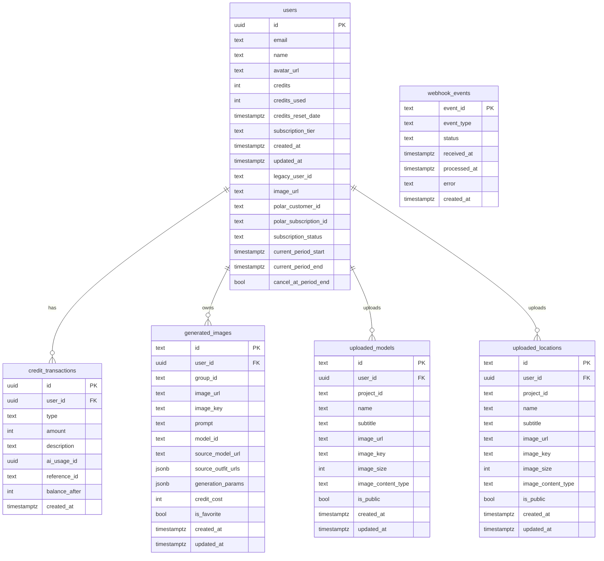
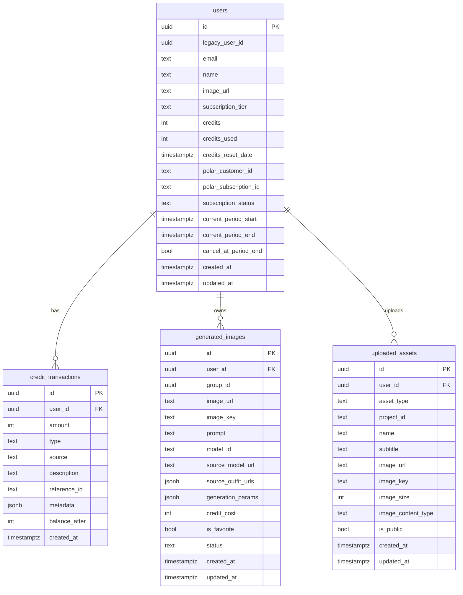

# Blooma DB Architecture (Verified Snapshot)

> Source: verified against Supabase `information_schema.columns` output shared on 2026-02-02. This is now the **authoritative schema snapshot** for public tables.

## 1) Current Schema (public)

### tables: `users`
- id (uuid, PK) — Supabase auth user id
- email (text, NOT NULL)
- name (text, nullable)
- avatar_url (text, nullable)
- credits (int, NOT NULL)
- credits_used (int, NOT NULL)
- credits_reset_date (timestamptz, NOT NULL)
- subscription_tier (text, NOT NULL) — e.g. `free`, `Small Brands`, `Agency`, `Studio`
- created_at (timestamptz, NOT NULL)
- updated_at (timestamptz, NOT NULL)
- legacy_user_id (text, nullable)
- image_url (text, nullable)
- polar_customer_id (text, nullable)
- polar_subscription_id (text, nullable)
- subscription_status (text, nullable)
- current_period_start (timestamptz, nullable)
- current_period_end (timestamptz, nullable)
- cancel_at_period_end (bool, nullable)

### tables: `credit_transactions`
- id (uuid, PK)
- user_id (uuid, FK -> users.id)
- type (text, NOT NULL) — `grant` | `consume` | `refund`
- amount (int, NOT NULL)
- description (text, NOT NULL)
- ai_usage_id (uuid, nullable)
- created_at (timestamptz, NOT NULL)
- reference_id (text, nullable) — idempotency key (e.g. Polar order id)
- balance_after (int, nullable)

### tables: `generated_images`
- id (text, PK)
- user_id (uuid, FK -> users.id)
- group_id (text, nullable) — batch id
- image_url (text, NOT NULL)
- image_key (text, nullable) ? R2 object key
- prompt (text, nullable)
- model_id (text, nullable)
- source_model_url (text, nullable)
- source_outfit_urls (jsonb, nullable)
- generation_params (jsonb, nullable)
- credit_cost (int, nullable)
- is_favorite (bool, nullable)
- created_at (timestamptz, nullable)
- updated_at (timestamptz, nullable)

### tables: `uploaded_models`
- id (text, PK)
- user_id (uuid, FK -> users.id)
- project_id (text, nullable)
- name (text, NOT NULL)
- subtitle (text, nullable)
- image_url (text, NOT NULL)
- image_key (text, nullable)
- image_size (int, nullable)
- image_content_type (text, nullable)
- is_public (bool, nullable)
- created_at (timestamptz, nullable)
- updated_at (timestamptz, nullable)

### tables: `uploaded_locations`
- id (text, PK)
- user_id (uuid, FK -> users.id)
- project_id (text, nullable)
- name (text, NOT NULL)
- subtitle (text, nullable)
- image_url (text, NOT NULL)
- image_key (text, nullable)
- image_size (int, nullable)
- image_content_type (text, nullable)
- is_public (bool, nullable)
- created_at (timestamptz, nullable)
- updated_at (timestamptz, nullable)

### tables: `webhook_events`
- event_id (text, PK)
- event_type (text, NOT NULL)
- status (text, NOT NULL) — `processing` | `processed` | `failed`
- received_at (timestamptz, NOT NULL)
- processed_at (timestamptz, nullable)
- error (text, nullable)
- created_at (timestamptz, NOT NULL)

### Postgres RPCs
- add_credits(p_user_id uuid/text, p_amount int)
- grant_credits_with_reset(p_user_id uuid/text, p_amount int, p_reset_date timestamptz)

---

## 1.1) Code ↔ DB Mismatch Watchlist (fix or align)

- `users.email`, `users.credits`, `users.credits_used`, `users.credits_reset_date`, `users.subscription_tier` are **NOT NULL** in DB, but code paths often treat them as nullable.
- `generated_images.id` is **text** in DB but treated like `uuid` in code (created via `crypto.randomUUID()`).
- `credit_transactions.description` is **NOT NULL** in DB but code allows nullable.
- `credit_transactions.ai_usage_id` exists in DB but is **not used** in code.
- `generated_images.created_at/updated_at`, `uploaded_* .created_at/updated_at` are **nullable** in DB; code assumes values exist.

---

## 2) Relationship Diagram (Mermaid ER, current)

---

## 3) Proposed Supabase DB Redesign (recommended)

### Goals
- Consistent UUID primary keys
- Clear separation between public assets and user-owned assets
- Idempotent billing webhooks and credit ledger integrity
- Fast gallery/history queries with proper indexes
- Safer multi-tenant access via RLS

### Proposed changes (summary)
1) **Standardize IDs**
   - All tables use `uuid` PK with `gen_random_uuid()` default.
   - Keep `users.id` as auth user id (uuid) to align with Supabase auth.

2) **Normalize credit ledger**
   - `credit_transactions.reference_id` UNIQUE per user for idempotency.
   - Add `source` (text) and `metadata` (jsonb) for audit.

3) **Generated images**
   - Use `jsonb` for `generation_params` and `source_outfit_urls` (array).
   - Add `status` (`pending`|`ready`|`failed`) to support async generation.

4) **Assets**
   - Consider unifying `uploaded_models` + `uploaded_locations` into a single `uploaded_assets` table with a `asset_type` enum (`model`|`location`).

5) **Indexes**
   - `credit_transactions(user_id, created_at desc)`
   - `generated_images(user_id, created_at desc)`
   - `generated_images(user_id, is_favorite, created_at desc)`
   - `uploaded_assets(user_id, created_at desc)`
   - `webhook_events(event_id)` unique

6) **RLS**
   - Enable RLS on all user-owned tables; policies by `auth.uid()`.

### Proposed ER (if unifying assets)

---

## 4) RLS Policy Sketch (Supabase)

- `users`: allow select/update only where `auth.uid() = id` (admin via service role).
- `credit_transactions`: select/insert only where `auth.uid() = user_id` (inserts via service role).
- `generated_images`: select/insert/update/delete only where `auth.uid() = user_id`.
- `uploaded_assets`: select public rows OR where `auth.uid() = user_id`.
- `webhook_events`: service role only.

---

## 5) Postgres Best-Practice Checklist (target state)

### Constraints & Consistency
- Enforce `NOT NULL` where business rules require it (align code + DB).
- Add `CHECK` constraints for enums (e.g., `credit_transactions.type`).
- Use `UUID` consistently for PK/FK (reduce text ids where possible).

### Indexing
- `credit_transactions(user_id, created_at desc)`
- `credit_transactions(user_id, reference_id)` UNIQUE for idempotency
- `generated_images(user_id, created_at desc)`
- `generated_images(user_id, is_favorite, created_at desc)`
- `uploaded_models(user_id, created_at desc)`
- `uploaded_locations(user_id, created_at desc)`
- `webhook_events(event_id)` UNIQUE

### JSONB Usage
- Keep `generated_images.source_outfit_urls` and `generation_params` as `jsonb` (already correct).
- Avoid storing mixed JSON/string values; normalize to JSONB only.

### RLS & Multi-Tenancy
- RLS enabled on all user-owned tables.
- Policies based on `auth.uid()` and `is_public` flags.

### Audit / Ledger Integrity
- `credit_transactions` should be append-only (no updates/deletes).
- Enforce idempotency with unique `(user_id, reference_id)` where `reference_id` is not null.

---

## 6) Next Steps / TODO

1) Decide whether to unify assets table or keep separate.
2) Add indexes & unique constraints listed above.
3) Align code nullability with DB constraints (see mismatch watchlist).
4) Add migrations and document the schema as source of truth.

---

## 7) Sources in Code (reference)

- `src/lib/db/users.ts`
- `src/lib/db/creditTransactions.ts`
- `src/lib/db/generatedImages.ts`
- `src/lib/db/customAssets.ts`
- `src/lib/db/webhookEvents.ts`
- `src/app/api/*` routes (models, locations, history, billing webhook, upload-image)
