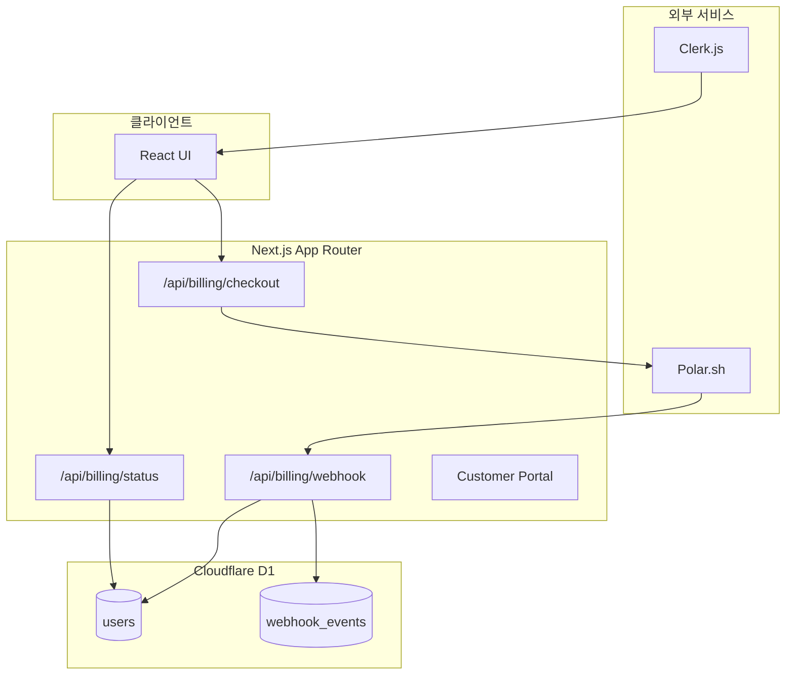
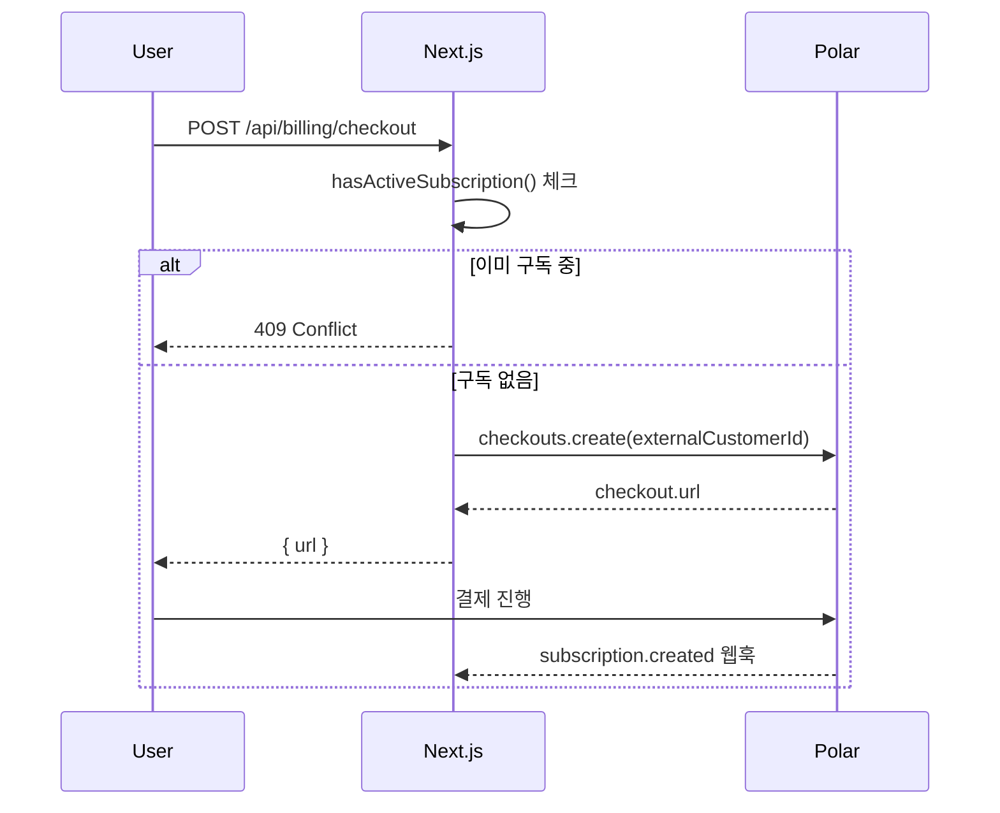
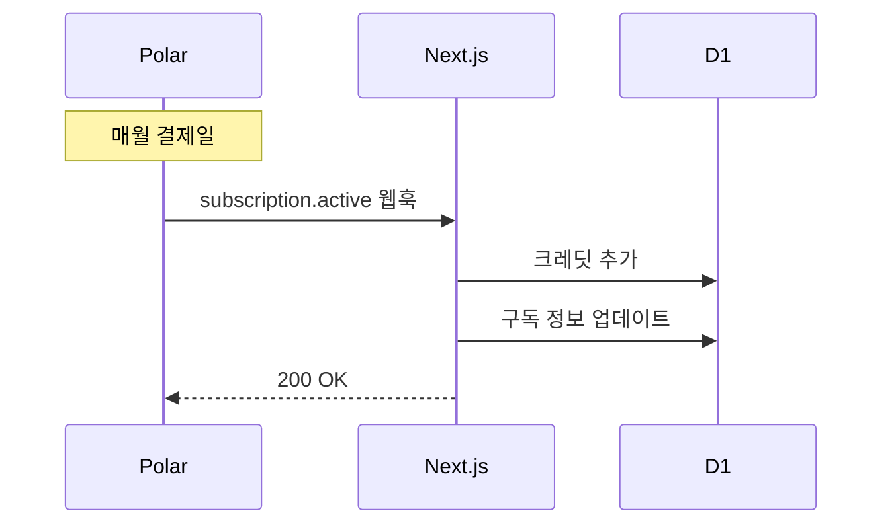
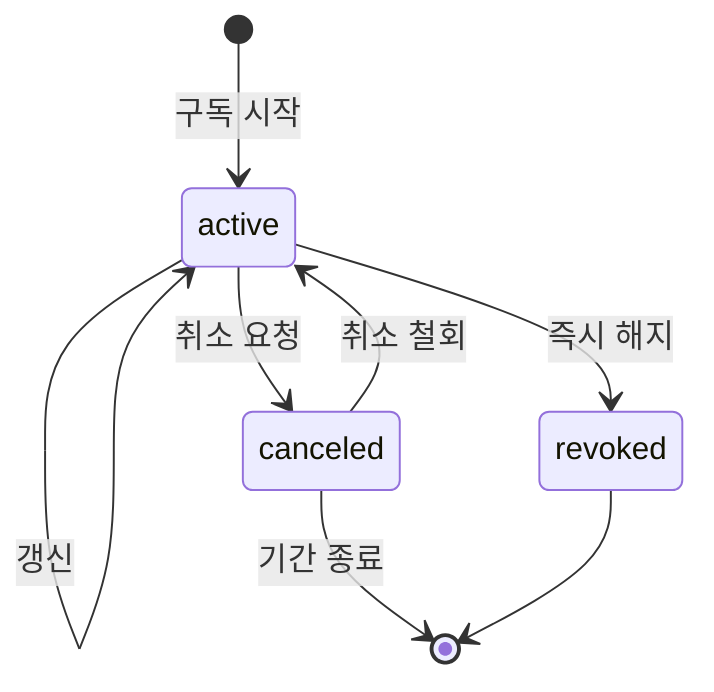

# Blooma 결제 시스템 문서

> **최종 업데이트**: 2025-12-15  
> **결제 프로바이더**: Polar.sh  
> **인증**: Clerk.js  
> **데이터베이스**: Cloudflare D1

---

## 목차
1. [시스템 아키텍처](#시스템-아키텍처)
2. [데이터 모델](#데이터-모델)
3. [결제 플로우](#결제-플로우)
4. [웹훅 처리](#웹훅-처리)
5. [구독 상태 관리](#구독-상태-관리)
6. [크레딧 시스템](#크레딧-시스템)
7. [API 엔드포인트](#api-엔드포인트)
8. [환경 변수](#환경-변수)

---

## 시스템 아키텍처



### 핵심 파일 구조
```
src/
├── app/api/billing/
│   ├── checkout/route.ts    # 체크아웃 세션 생성
│   ├── webhook/route.ts     # Polar 웹훅 처리
│   └── status/route.ts      # 구독 상태 조회
├── lib/
│   ├── billing/
│   │   ├── plans.ts         # 플랜 정의 및 매핑
│   │   └── subscription.ts  # 구독 상태 체크
│   ├── db/
│   │   ├── users.ts         # 사용자 DB 작업
│   │   └── webhookEvents.ts # 웹훅 멱등성
│   ├── credits.ts           # 크레딧 관리
│   └── customerportal/
│       └── route.ts         # 고객 포털 세션
└── migrations/
    ├── 0000_baseline.sql
    ├── 0001_webhook_events.sql
    └── 0002_subscription_fields.sql
```

---

## 데이터 모델

### users 테이블
| 컬럼 | 타입 | 설명 |
|------|------|------|
| `id` | TEXT PK | Clerk user ID |
| `clerk_user_id` | TEXT | Clerk user ID (동일) |
| `email` | TEXT | 이메일 |
| `subscription_tier` | TEXT | 플랜: 'Starter' / 'Pro' / 'Studio' / null |
| `subscription_status` | TEXT | 상태: 'active' / 'canceled' / 'revoked' 등 |
| `polar_customer_id` | TEXT | Polar 고객 ID |
| `polar_subscription_id` | TEXT | Polar 구독 ID |
| `current_period_start` | TEXT | 현재 결제 기간 시작 (ISO 8601) |
| `current_period_end` | TEXT | 현재 결제 기간 종료 (ISO 8601) |
| `cancel_at_period_end` | INTEGER | 기간 종료 시 취소 여부 (0/1) |
| `credits` | INTEGER | 총 크레딧 |
| `credits_used` | INTEGER | 사용한 크레딧 |
| `credits_reset_date` | TEXT | 크레딧 리셋 날짜 |

### webhook_events 테이블
| 컬럼 | 타입 | 설명 |
|------|------|------|
| `event_id` | TEXT PK | 웹훅 이벤트 ID (webhook-id 헤더) |
| `event_type` | TEXT | 이벤트 타입 |
| `status` | TEXT | 'processing' / 'processed' / 'failed' |
| `received_at` | TEXT | 수신 시간 |
| `processed_at` | TEXT | 처리 완료 시간 |
| `error` | TEXT | 에러 메시지 (실패 시) |

---

## 결제 플로우

### 1. 체크아웃 (신규 구독)


### 2. 구독 갱신 (자동)


---

## 웹훅 처리

### 지원 이벤트
| 이벤트 | 처리 내용 |
|--------|----------|
| `subscription.created` | 초기 크레딧 지급 + 구독 정보 저장 |
| `subscription.active` | 갱신 크레딧 지급 + 구독 정보 업데이트 |
| `subscription.updated` | 구독 정보 업데이트 |
| `subscription.canceled` | 취소 상태 저장 (기간 종료까지 유효) |
| `subscription.uncanceled` | 취소 철회 처리 |
| `subscription.revoked` | 즉시 구독 해지 (tier=null) |
| `order.created` | billing_reason=subscription_cycle일 때만 크레딧 지급 |

### 멱등성 처리
```typescript
// 1. webhook-id 헤더에서 이벤트 ID 추출
const webhookId = headers['webhook-id']

// 2. 이벤트 선점 시도
const { claimed } = await tryClaimWebhookEvent(webhookId, eventType)
if (!claimed) {
  return { received: true, duplicate: true }
}

// 3. 처리 후 상태 업데이트
await markWebhookEventProcessed(webhookId)
```

### 서명 검증
- `standardwebhooks` 라이브러리 사용
- `webhook-id`, `webhook-timestamp`, `webhook-signature` 헤더 검증
- Raw body로 검증 수행 (`request.text()`)

---

## 구독 상태 관리

### hasActiveSubscription() 로직
```typescript
function evaluateD1Subscription(user: D1UserRecord): boolean {
  // 1. 'active' 또는 'trialing' 상태면 활성
  if (isActiveStatus(subscription_status)) return true
  
  // 2. 'canceled' + cancel_at_period_end + 기간 내면 활성
  if (
    status === 'canceled' &&
    cancel_at_period_end &&
    periodEnd > now
  ) {
    return isActiveTier(subscription_tier)
  }
  
  // 3. revoked/ended면 비활성
  return false
}
```

### 구독 상태 전이


---

## 크레딧 시스템

### 플랜별 크레딧
| 플랜 | 월간 크레딧 | Product ID |
|------|------------|------------|
| Starter | 100 | `POLAR_STARTER_PRODUCT_ID` |
| Pro | 500 | `POLAR_PRO_PRODUCT_ID` |
| Studio | 2000 | `POLAR_STUDIO_PRODUCT_ID` |

### 크레딧 지급 정책
- **구독 생성**: `subscription.created` → 플랜 크레딧 지급
- **구독 갱신**: `subscription.active` → 플랜 크레딧 지급
- **주문 생성**: `order.created` + `billing_reason=subscription_cycle` → 플랜 크레딧 지급

### 크레딧 사용
```typescript
// src/lib/credits.ts
await consumeCredits(userId, creditCost)
// 실패 시 InsufficientCreditsError 발생

// 환불
await refundCredits(userId, creditAmount)
```

---

## API 엔드포인트

### 빌링 API
| 메서드 | 경로 | 설명 |
|--------|------|------|
| POST | `/api/billing/checkout` | 체크아웃 세션 생성 |
| POST | `/api/billing/webhook` | Polar 웹훅 수신 |
| GET | `/api/billing/status` | 구독 상태 조회 |

### 사용자 API
| 메서드 | 경로 | 설명 |
|--------|------|------|
| GET | `/api/user/credits` | 크레딧 잔액 조회 |
| GET | `/api/user/subscription` | 상세 구독 정보 |

### 요청/응답 예시
```typescript
// POST /api/billing/checkout
Request: { planId: 'Pro' }
Response: { url: 'https://checkout.polar.sh/...' }

// GET /api/billing/status
Response: { active: true }

// GET /api/user/credits
Response: { total: 500, used: 120, remaining: 380, tier: 'Pro' }
```

---

## 환경 변수

| 변수명 | 필수 | 설명 |
|--------|------|------|
| `POLAR_ACCESS_TOKEN` | ✅ | Polar API 토큰 |
| `POLAR_WEBHOOK_SECRET` | ✅ | 웹훅 서명 검증 시크릿 |
| `POLAR_SERVER` | ❌ | 'sandbox' / 'production' (기본: production) |
| `POLAR_STARTER_PRODUCT_ID` | ✅ | Starter 플랜 Product ID |
| `POLAR_PRO_PRODUCT_ID` | ✅ | Pro 플랜 Product ID |
| `POLAR_STUDIO_PRODUCT_ID` | ✅ | Studio 플랜 Product ID |
| `CLOUDFLARE_D1_DATABASE_ID` | ✅ | D1 데이터베이스 ID |
| `CLOUDFLARE_D1_API_TOKEN` | ✅ | D1 API 토큰 |
| `CLOUDFLARE_ACCOUNT_ID` | ✅ | Cloudflare 계정 ID |

---

## 트러블슈팅

### 웹훅이 처리되지 않음
1. `POLAR_WEBHOOK_SECRET` 확인
2. `webhook_events` 테이블에서 해당 이벤트 상태 확인
3. 로그에서 `[webhook]` 태그 검색

### 구독 상태가 맞지 않음
1. `users` 테이블에서 해당 사용자 조회
2. `subscription_status`, `current_period_end`, `cancel_at_period_end` 확인
3. Polar 대시보드와 비교

### 크레딧이 중복 지급됨
1. `webhook_events` 테이블에서 중복 이벤트 확인
2. 동일 `event_id`가 여러 번 있으면 멱등성 실패

---

## 롤백 절차

### 마이그레이션 롤백
```sql
-- webhook_events 테이블 삭제
DROP TABLE IF EXISTS webhook_events;

-- users 테이블 컬럼 삭제
-- SQLite는 ALTER TABLE DROP COLUMN 미지원
-- 새 테이블 생성 후 데이터 이전 필요
```

### 코드 롤백
관련 파일 Git revert:
- `src/app/api/billing/webhook/route.ts`
- `src/lib/db/users.ts`
- `src/lib/db/webhookEvents.ts`
- `src/lib/billing/subscription.ts`
- `src/lib/customerportal/route.ts`
