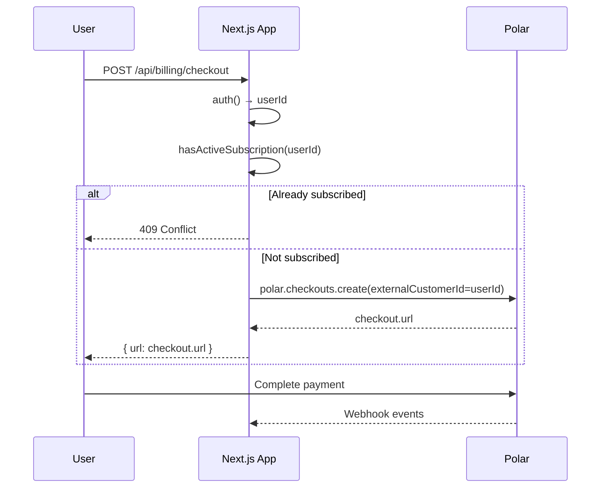
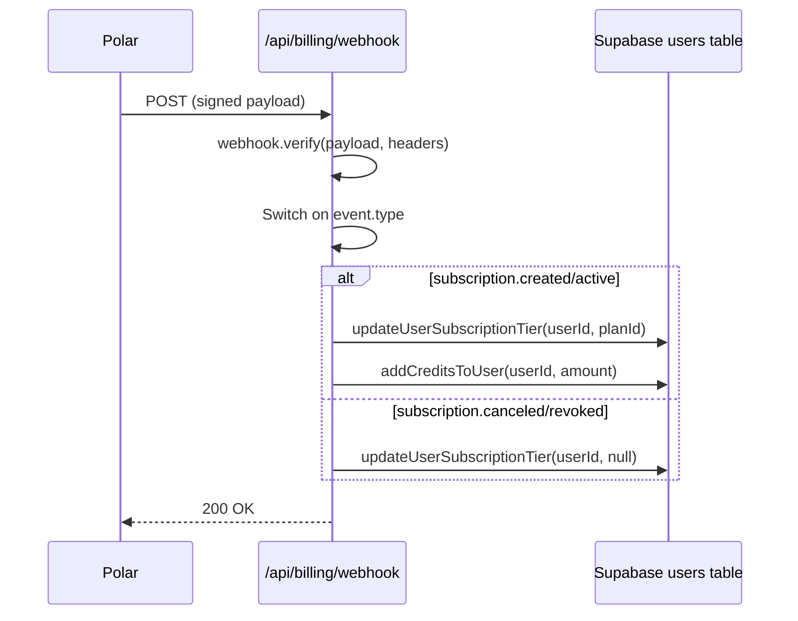
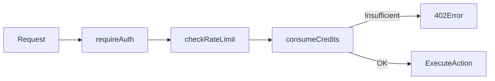

# Polar.sh Subscription Integration Audit Report

> **Audit Date**: 2025-12-15  
> **Scope**: Next.js 16 App Router repository - User-based subscription model  
> **Verdict**: ⚠️ **Several Critical/High issues requiring remediation**

---

## 1. Integration Point Map

### 표1: 핵심 파일 목록

| 파일 경로 | 목적 | 업데이트 엔티티 |
|-----------|------|-----------------|
| `src/app/api/billing/checkout/route.ts` | 체크아웃 세션 생성, Polar로 리다이렉트 | - (Polar API 호출) |
| `src/app/api/billing/webhook/route.ts` | Polar 웹훅 수신 및 처리 | `users.subscription_tier`, `users.credits` |
| `src/app/api/billing/status/route.ts` | 구독 활성 상태 조회 | - (읽기 전용) |
| `src/lib/billing/subscription.ts` | `hasActiveSubscription()` 권한 체크 | - (읽기 전용) |
| `src/lib/billing/plans.ts` | 플랜↔Product ID 매핑 | - (설정) |
| `src/lib/db/users.ts` | User DB CRUD, 크레딧/구독 업데이트 | `users` 테이블 |
| `src/lib/credits.ts` | 크레딧 차감/환불 로직 | `users.credits_used` |

---

## 2. Flow Diagrams

### (A) Checkout Flow


### (B) Webhook Flow


### (C) Permission Gating Flow (Current)


> ⚠️ **WARNING**: Feature gating은 subscription_tier가 아닌 credits 잔액만 확인함.  
> 구독이 취소되어도 남은 크레딧으로 계속 사용 가능 (의도된 동작일 수 있음).

---

## 3. Data Model Validation

### users 테이블 현재 구조
| 필드 | 존재여부 | 비고 |
|------|----------|------|
| `id` (PK) | ✅ | Supabase auth user ID 사용 |
| `legacy_user_id` | ✅ | 동일 값 저장 |
| `subscription_tier` | ✅ | 'Starter'/'Pro'/'Studio'/null |
| `credits` | ✅ | 총 크레딧 |
| `credits_used` | ✅ | 사용 크레딧 |
| `credits_reset_date` | ✅ | 리셋 날짜 |
| `polar_customer_id` | ❌ | **없음** |
| `polar_subscription_id` | ❌ | **없음** |
| `subscription_status` | ❌ | **없음** (tier만 저장) |
| `current_period_start` | ❌ | **없음** |
| `current_period_end` | ❌ | **없음** |
| `cancel_at_period_end` | ❌ | **없음** |

### 별도 테이블 부재
| 테이블 | 존재여부 | 비고 |
|--------|----------|------|
| `subscriptions` | ❌ | 없음 - users에 통합 |
| `orders` / `invoices` | ❌ | 없음 |
| `webhook_events` | ❌ | **없음 - 멱등성 불가** |

---

## 4. Checklist: PASS/FAIL/UNKNOWN

### 표2: 보안/정합성 체크리스트

| 항목 | 결과 | 근거 |
|------|------|------|
| **웹훅 서명 검증** | ✅ PASS | `webhook/route.ts:53` - `webhook.verify(payload, headers)` |
| **원문(raw body) 기반 검증** | ✅ PASS | `request.text()` 후 검증 (L50-53) |
| **비밀키 서버 env 전용** | ✅ PASS | `POLAR_WEBHOOK_SECRET` 사용 |
| **리플레이 방지 (timestamp)** | ⚠️ UNKNOWN | standardwebhooks 내부 구현에 의존 |
| **이벤트 ID 중복 방지** | ❌ FAIL | event_id 저장/체크 로직 없음 |
| **실패 시 재처리 전략** | ❌ FAIL | 이벤트 저장 안 함, 수동 재처리 불가 |
| **subscription.created 처리** | ✅ PASS | L71-72 |
| **subscription.active 처리** | ✅ PASS | L79-80 |
| **subscription.updated 처리** | ✅ PASS | L75-76 |
| **subscription.canceled 처리** | ✅ PASS | L83-84 |
| **subscription.uncanceled 처리** | ❌ FAIL | 핸들러 없음 |
| **subscription.revoked 처리** | ✅ PASS | L87-88 |
| **order.created billing_reason 확인** | ❌ FAIL | billing_reason 미확인 (L91-93) |
| **갱신 시 기간 연장 로직** | ⚠️ UNKNOWN | period_end 저장 안 함 |
| **동시 결제 중복 방지** | ⚠️ PARTIAL | checkout 시 hasActiveSubscription 확인하나, race condition 가능 |
| **서버 측 기능 게이팅** | ⚠️ PARTIAL | credits 기반만 존재, subscription 기반 없음 |
| **period_end 후 revoke 처리** | ❌ FAIL | 저장 안 함, 스케줄러 없음 |
| **구조화된 로그** | ✅ PASS | console.log에 context 포함 |
| **PII/시크릿 로깅 방지** | ✅ PASS | extractLogInfo로 필터링 |
| **Polar-DB 동기화 작업** | ❌ FAIL | reconcile 작업 없음 |

---

## 5. Issue List (Prioritized)

### 🔴 Critical

#### C1: 웹훅 멱등성 없음
- **위치**: `src/app/api/billing/webhook/route.ts`
- **재현**: Polar에서 동일 이벤트 2번 전송 (네트워크 재시도)
- **영향**: 크레딧 중복 지급 (`addCreditsToUser` 2회 호출)
- **수정 가이드**:
  1. `webhook_events` 테이블 생성 (`event_id TEXT PRIMARY KEY`)
  2. 처리 전 중복 체크: `SELECT 1 FROM webhook_events WHERE event_id = ?`
  3. 처리 후 저장: `INSERT INTO webhook_events (event_id, type, processed_at) VALUES (?, ?, ?)`

#### C2: Polar 구독 ID/기간 미저장
- **위치**: `src/lib/db/users.ts`, 스키마
- **재현**: 구독 갱신 시 current_period_end 알 수 없음
- **영향**: 만료 후 접근 차단 불가, 고객 문의 대응 불가
- **수정 가이드**:
  ```sql
  ALTER TABLE users ADD COLUMN polar_subscription_id TEXT;
  ALTER TABLE users ADD COLUMN subscription_status TEXT;
  ALTER TABLE users ADD COLUMN current_period_end TEXT;
  ALTER TABLE users ADD COLUMN cancel_at_period_end INTEGER DEFAULT 0;
  ```

### 🟠 High

#### H1: subscription.uncanceled 이벤트 미처리
- **위치**: `src/app/api/billing/webhook/route.ts`
- **재현**: 유저가 취소 후 취소 철회 시
- **영향**: subscription_tier가 null로 유지됨
- **수정 가이드**: `handleSubscriptionUncanceled` 핸들러 추가

#### H2: order.created에서 billing_reason 미확인
- **위치**: `src/app/api/billing/webhook/route.ts` (L414-433)
- **재현**: 갱신 결제 vs 최초 결제 구분 불가
- **영향**: 갱신 시 크레딧 중복 지급 또는 누락 가능
- **수정 가이드**: `billing_reason === 'subscription_cycle'` 확인 후 크레딧 지급

#### H3: Customer Portal 미완성
- **위치**: `src/lib/customerportal/route.ts` (L11)
- **재현**: `customerId: "<value>"` 하드코딩
- **영향**: 고객 포탈 접근 불가
- **수정 가이드**: `externalCustomerId` 사용하여 customer 조회 후 세션 생성

### 🟡 Medium

#### M1: 동시 결제 Race Condition
- **위치**: `src/app/api/billing/checkout/route.ts` (L32-35)
- **재현**: 2개 탭에서 동시에 체크아웃 시작
- **영향**: 중복 구독 생성 가능 (낮은 확률)
- **수정 가이드**: Redis lock 또는 DB unique constraint on `polar_subscription_id`

#### M2: 구독 기반 Feature Gating 없음
- **위치**: API routes 전체
- **재현**: 구독 취소 후 남은 크레딧으로 계속 사용
- **영향**: 의도된 동작일 수 있으나, "구독자 전용" 기능 구현 불가
- **수정 가이드**: 필요 시 `hasActiveSubscription` 체크 추가

#### M3: Out-of-Order 이벤트 처리 취약
- **위치**: `src/app/api/billing/webhook/route.ts`
- **재현**: `subscription.updated`가 `subscription.created`보다 먼저 도착
- **영향**: 상태 불일치 가능
- **수정 가이드**: 이벤트 timestamp 비교 또는 상태 머신 도입

### 🟢 Low

#### L1: Reconciliation 작업 없음
- **위치**: 없음 (새로 구현 필요)
- **재현**: Polar 상태와 DB 불일치 발생 시 자동 복구 불가
- **영향**: 수동 개입 필요
- **수정 가이드**: 주기적 cron 또는 스케줄러로 Polar API 조회 후 DB 동기화

#### L2: 웹훅 처리 메트릭 없음
- **위치**: `src/app/api/billing/webhook/route.ts`
- **재현**: -
- **영향**: 실패율/지연 모니터링 불가
- **수정 가이드**: 처리 시간, 성공/실패 카운터 로깅 또는 메트릭 서비스 연동

---

## 6. Summary

| 카테고리 | PASS | FAIL | UNKNOWN |
|----------|------|------|---------|
| 웹훅 보안 | 3 | 2 | 1 |
| 이벤트 핸들링 | 5 | 2 | 1 |
| 멱등성/중복 | 0 | 3 | 0 |
| 권한 게이팅 | 1 | 1 | 0 |
| 운영성 | 2 | 2 | 0 |

**즉시 조치 필요**: C1 (멱등성), C2 (구독 데이터 모델)  
**권장 조치**: H1-H3 (이벤트 처리 완성, 포탈 수정)

---

## UNKNOWN 항목 (추가 확인 필요)

1. **리플레이 방지**: `standardwebhooks` 라이브러리가 timestamp 검증을 수행하는지 문서/소스 확인 필요
2. **갱신 크레딧 정책**: `subscription.active` 이벤트가 매월 발생하는지, 최초 1회인지 Polar 문서 확인 필요
3. **의도된 동작 확인**: 크레딧 기반 게이팅이 의도된 것인지, 구독 기반 게이팅도 필요한지 비즈니스 확인 필요
